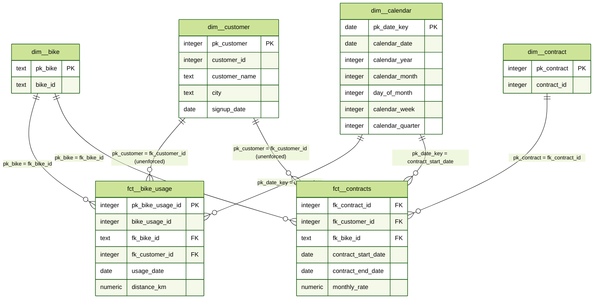

# Data Model Bike Analytics

```mermaid
%%{init: { 'theme':'forest', 'sequence': {'useMaxWidth':false} } }%%

erDiagram

    fct__bike_usage {
        integer pk_bike_usage_id PK
        integer bike_usage_id
        text fk_bike_id FK
        integer fk_customer_id FK
        date usage_date
        numeric distance_km
    }

    fct__contracts {
        integer fk_contract_id FK
        integer fk_customer_id FK
        text fk_bike_id FK
        date contract_start_date
        date contract_end_date
        numeric monthly_rate
    }

    dim__bike {
        text pk_bike PK
        text bike_id
    }

    dim__customer {
        integer pk_customer PK
        integer customer_id
        text customer_name
        text city
        date signup_date
    }

    dim__contract {
        integer pk_contract PK
        integer contract_id
    }

    dim__calendar {
        date pk_date_key PK
        date calendar_date
        integer calendar_year
        integer calendar_month
        integer day_of_month
        integer calendar_week
        integer calendar_quarter
    }

    dim__bike ||--o{ fct__bike_usage : "pk_bike = fk_bike_id"
    dim__customer ||--o{ fct__bike_usage : "pk_customer = fk_customer_id (unenforced)"
    dim__bike ||--o{ fct__contracts : "pk_bike = fk_bike_id"
    dim__customer ||--o{ fct__contracts : "pk_customer = fk_customer_id (unenforced)"
    dim__contract ||--o{ fct__contracts : "pk_contract = fk_contract_id"
    dim__calendar ||--o{ fct__bike_usage : "pk_date_key = usage_date"
    dim__calendar ||--o{ fct__contracts : "pk_date_key = contract_start_date"

```
